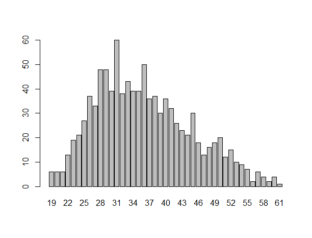
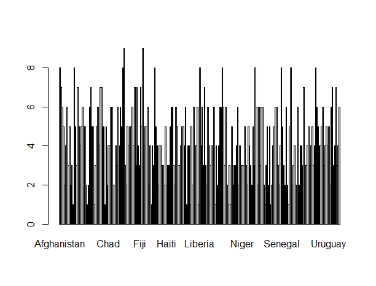
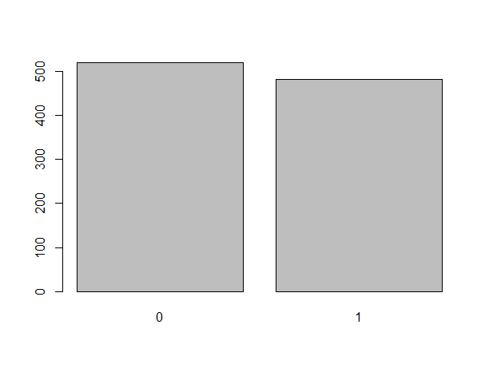
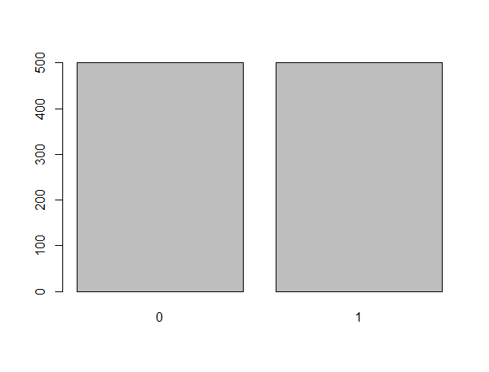
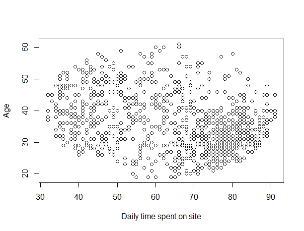
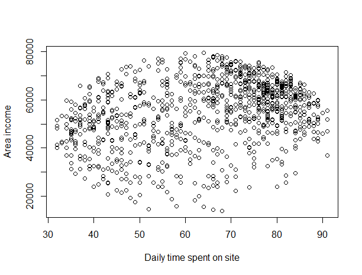
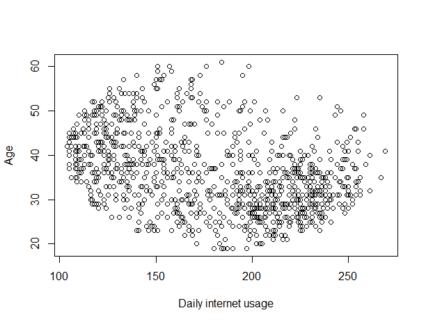
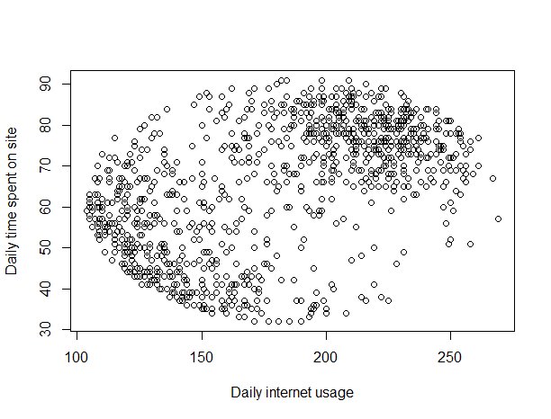
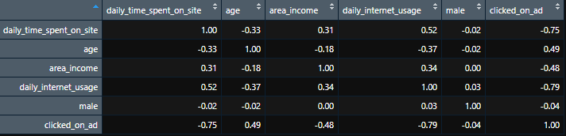

# **Advert Clicks Analysis (Week 12 IP)**

## **Defining the Research Problem**

### **Defining the Question**

A Kenyan entrepreneur has created an online cryptography course and would want to advertise it on her blog. She currently targets audiences originating from various countries. In the past, she ran ads to advertise a related course on the same blog and collected data in the process. She would now like to employ your services as a Data Science Consultant to help her identify which individuals are most likely to click on her ads.

**Goal** - Identify individuals who are most likely going to click on her course advertisements.

### **Defining the metric for success**

This undertaking is going to be considered successful in the event that I am able to identify the individuals most likely to click on the ads.

### **Understanding the context**

The work assigned to me is to work for a Kenyan entrepreneur that offers courses online. They have offered several before and have collected data from the advertisements they ran then. They are now introducing a new course, cryptography, which is a method of protecting information and communications through the use of codes. They need to know the individuals that will click on the advertisement so as to reach them in a more efficient way or rather be able to narrow down to those individuals. This is where I come in. I identify the individuals.

### **Recording the experimental design**

Below are the stages that I am going to follow:

1. Data reading and checking
2. Data tidying
3. Exploratory Data Analysis(Univariate and Bivariate)
4. Conclusion and recommendations
5. Data Relevance

### **Relevance of Data**

The data provided is from the entrepreneur's collection and it entails the audience that their blogs reach. It is thus relevant to our analysis and meaningful conclusions can be made from it.

## **Data Reading and Checking**

### **Loading our Data**
```R
# installing the relevant packages
install.packages("data.table")
library(data.table)
install.packages("tidyverse")
library(tidyverse)

# loading our dataset using a url
dataset <- fread("http://bit.ly/IPAdvertisingData")

```

### **Checking our Data**
```R
#checking our top(previewing the first six rows of the dataset)
head(dataset)

#having a tabular view of the dataset
View(dataset)

#viewing the classes of the dataset and the datatypes of the various columns
str(dataset)

#checking the number of rows and columns
dim(dataset)
#we have 1000 rows and 10 columns

```

## **Data Tidying**

From our preview, we can see that our dataset has numeric values that need to be changed to an integer data type for analysis. In addition, the column names also need to be changed to a more usable format to avoid any mis-references.

```R
#changing the column names to a more usable format. 
names(dataset)[names(dataset) == "Daily Time Spent on Site"] <- "daily_time_spent_on_site"
names(dataset)[names(dataset) == "Age"] <- "age"
names(dataset)[names(dataset) == "Area Income"] <- "area_income"
names(dataset)[names(dataset) == "Daily Internet Usage"] <- "daily_internet_usage"
names(dataset)[names(dataset) == "Ad Topic Line"] <- "ad_topic_line"
names(dataset)[names(dataset) == "City"] <- "city"
names(dataset)[names(dataset) == "Male"] <- "male"
names(dataset)[names(dataset) == "Country"] <- "country"
names(dataset)[names(dataset) == "Timestamp"] <- "timestamp"
names(dataset)[names(dataset) == "Clicked on Ad"] <- "clicked_on_ad"

#previewing the dataset
head(dataset)

#changing the numeric datatypes to numeric
dataset$daily_time_spent_on_site <- as.integer(as.numeric(dataset$daily_time_spent_on_site))
dataset$area_income <- as.integer(as.numeric(dataset$area_income))
dataset$daily_internet_usage <- as.integer(as.numeric(dataset$daily_internet_usage))

#checking for the change above
str(dataset)

```

Now that we have changed the column names and the appropriate data types, we can go on to find inconsistencies in the dataset

```R
#checking for missing values
colSums(is.na(dataset))
#we do not have any missing values.

#checking for duplicate values
duplicate_rows <- dataset[duplicated(dataset),]
duplicate_rows
#we do not have any duplicated values either.

#checking for outliers using boxlots
boxplot(dataset$daily_time_spent_on_site)
#there are no visible outliers according to the plot.

boxplot(dataset$age)
#there are no visible outliers according to the plot.

boxplot(dataset$area_income)
#There are some outliers and these are values below 20,000. This is normal as sometimes income may be very low. I am thus not going to remove this.

boxplot(dataset$daily_internet_usage)
#there are no visible outliers according to the plot.

boxplot(dataset$male)
#there are no visible outliers according to the plot.

```
```R
#dropping the columns that we are not going to use.
dataset = subset(dataset, select = -c(ad_topic_line,timestamp))
```

We now have a dataset that is verified to be clean. We can move to the exploratory data analysis.


## **Exploratory Data Analysis**

In the exploratory data analysis, we are going to perform univariate and bivariate analysis only. this is what is required at the moment for us to determine the individuals we need.

### **Univariate Analysis**

We are going to measure central tendencies as well as dispersion measures. We are also going to have plots for the different measurements.

#### 1.**Measures of Central Tendency** 

We are going to find the following measures of central tendency;

- Mean

- Median

- Mode

**a)** Mean
```R
#finding the mean for various columns
daily_time_spent_on_site_mean <- mean(dataset$daily_time_spent_on_site)
daily_time_spent_on_site_mean
#the average time spent on the site daily is 64.493 units of time.

area_income_mean <- mean(dataset$area_income)
area_income_mean
#the average area income is 54,999.50 Shillings.

daily_internet_usage_mean <- mean(dataset$daily_internet_usage)
daily_internet_usage_mean
#the average daily internet usage is 179.506.
```
The following are the means for the columns we have found

i) Daily time spent on site - 64.493

ii) Area income - 54,999.50

iii) Daily internet usage - 179.506

**b)** Median
```R
#finding the median for various columns
daily_time_spent_on_site_median <- median(dataset$daily_time_spent_on_site)
daily_time_spent_on_site_median
#the median time spent daily on the site is 68.

age_median <- median(dataset$age)
age_median
#the age median is 35 years.

area_income_median <- median(dataset$area_income)
area_income_median
#the area income median is 57,011.5 shillings.

daily_internet_usage_median <- median(dataset$daily_internet_usage)
daily_internet_usage_median
#the daily usage of internet median is 182.5
```
The following are the medians for the columns we have found

i) Daily time spent on site - 68

ii) Age - 35

ii) Area income - 57,011.50

iii) Daily internet usage - 182.5

**c)** Mode
```R
#finding the mode for various columns
#since there is not an inbuilt function for finding the mode, we will create a function to find mode.
getmode <- function(v) {
   uniqv <- unique(v)
   uniqv[which.max(tabulate(match(v, uniqv)))]
}

daily_time_spent_on_site_mode <- getmode(dataset$daily_time_spent_on_site)
daily_time_spent_on_site_mode
#the mode for the daily time spent on the site is 78.

age_mode <- getmode(dataset$age)
age_mode
#the most occuring age in our dataset is 31

area_income_mode <- getmode(dataset$area_income)
area_income_mode
#the most occuring area income is 51636

daily_internet_usage_mode <- getmode(dataset$daily_internet_usage)
daily_internet_usage_mode
#the most occuring daily usage of internet is 231.

male_mode <- getmode(dataset$male)
male_mode
#most people in the dataset were not male.

```
The following are the modes for the columns we have found

i) Daily time spent on site - 78

ii) Age - 31

iii) Area income - 51636

iv) Daily internet usage - 231

v) Male - 0

- This findings of modes shows us that most of the people that visit the site have the above characteristics.

#### 2. **Measures of Dispersion** 

**a)** Minimum and maximum
```R
daily_time_spent_on_site_min <- min(dataset$daily_time_spent_on_site)
daily_time_spent_on_site_max <- max(dataset$daily_time_spent_on_site)
daily_time_spent_on_site_min
daily_time_spent_on_site_max
#minimum = 32, maximum = 91

age_min <- min(dataset$age)
age_max <- max(dataset$age)
age_min
age_max
#minimum = 19, maximum = 61

area_income_min <- min(dataset$area_income)
area_income_max <- max(dataset$area_income)
area_income_min
area_income_max
#minimum = 13,996, maximum = 79,484

daily_internet_usage_min <- min(dataset$daily_internet_usage)
daily_internet_usage_max <- max(dataset$daily_internet_usage)
daily_internet_usage_min
daily_internet_usage_max
#minimum = 104, maximum = 269

```
**b)** Range
```R
daily_time_spent_on_site_range <- range(dataset$daily_time_spent_on_site)
age_range <- range(dataset$age)
area_income_range <- range(dataset$area_income)
daily_internet_usage_range <- range(dataset$daily_internet_usage)
daily_time_spent_on_site_range
#range = 32-91
age_range
#range = 19-61
area_income_range
#range = 13996-79484
daily_internet_usage_range
#range = 104-269

```
**c)** Quantile
```R
daily_time_spent_on_site_quantile <- quantile(dataset$daily_time_spent_on_site)
age_quantile <- quantile(dataset$age)
area_income_quantile <- quantile(dataset$area_income)
daily_internet_usage_quantile <- quantile(dataset$daily_internet_usage)
```
**d)** Variance
```R
daily_time_spent_on_site_variance <- var(dataset$daily_time_spent_on_site)
age_variance <- var(dataset$age)
area_income_variance <- var(dataset$area_income)
daily_internet_usage_variance <- var(dataset$daily_internet_usage)
daily_time_spent_on_site_variance
#variance = 251.4834
age_variance
#variance = 77.18611
area_income_variance
#variance = 179951959
daily_internet_usage_variance
#variance = 1926.825
```
**e)** Standard Deviation
```R
daily_time_spent_on_site_sd <- sd(dataset$daily_time_spent_on_site)
age_sd <- sd(dataset$age)
area_income_sd <- sd(dataset$area_income)
daily_internet_usage_sd <- sd(dataset$daily_internet_usage)
daily_time_spent_on_site_sd
#standard deviation = 15.85823
age_sd
#standard deviation = 8.785562
area_income_sd
#standard deviation = 13414.62
daily_internet_usage_sd
#standard deviation = 43.89561
```

**Univariate Bar graphs**

```R
age <- dataset$age
age_frequency <- table(age)
barplot(age_frequency)
```


- We can see that our graph is positively skewed. It also shows that most people who visit the site are in the age of 31 years.

```R
country <- dataset$country
country_frequency <- table(country)
country_frequency
barplot(country_frequency)
```


The country plot is a bit squeezed but from viewing the countries the following are the top countries with the highest clicks of 9 and 8;

- Czech Republic

- France

- Afghanistan

- Australia

- Cyprus

- Greece

- Liberia

- Turkey

- South Africa

- Senegal

- Peru

```R
male <- dataset$male
male_frequency <- table(male)
barplot(male_frequency)
```


- The most number of people who visited the site were not male.

```R
clicked_on_ad <- dataset$clicked_on_ad
clicked_on_ad_frequency <- table(clicked_on_ad)
barplot(clicked_on_ad_frequency)
```


### **Bivariate Analysis**

In our bivariate analysis, we are going to look at several specific columns in order for us to get a picture of relationships between the various attributes in the dataset.

### **Scatter Plots**

**i)** Daily time spent on site vs Age

```R
daily_time_spent_on_site <- dataset$daily_time_spent_on_site
plot(daily_time_spent_on_site, age, xlab="Daily time spent on site", ylab="Age")
```


- There doesn't seem to be a relation between the two fields

**ii)** Daily time spent on site vs Area income
```R
area_income <- dataset$area_income
plot(daily_time_spent_on_site, area_income, xlab="Daily time spent on site", ylab="Area income")
```


- There doesn't seem to be a relation between the two fields

**iii)** Daily internet usage vs Age
```R
daily_internet_usage <- dataset$daily_internet_usage
plot(daily_internet_usage, age, xlab="Daily internet usage", ylab="Age")
```


- There doesn't seem to be a relation between the two fields

**iv)** Daily internet usage vs Daily time spent on site
```R
plot(daily_internet_usage, daily_time_spent_on_site, xlab="Daily internet usage", ylab="Daily time spent on site")
```


- From the above plot, there seems to be a relationship between the two fields because there are two clusters
formed on the plot. It seem the higher one spends time on the internet the higher time they spend on the site.

### **Correlation Matrix**
```R
numeric_cols <- dataset %>% select(daily_time_spent_on_site, age, area_income, daily_internet_usage, male, clicked_on_ad)
corr <- cor(numeric_cols, method = "pearson")
corr <- round(corr, 2)
view(corr)
```


- From the correlation matrix, we can see that clicking on an ad had a strong relation with daily time spent on the site and the daily internet usage of a person. Although there was also a relation with some other fields, the two had the higher correlation scores.

- There is also a relation between the daily internet usage and the daily time spent on the site. This confirms our earlier doubts with the scatter plot. Although not much significant, the relation is visible.


# **PART 2**
## **Supervised Learning Algorithms**

After our eda analysis, we go on to perform supervised learning algorithms for prediction of whether a customer would click on the adverts or not.
We will perform the SVM model and the kNN model to see their perfomances in order to achieve the best score.

**Metric For Success**

Our metric for success in this case is going to be a minimum accuracy score of 80%. With this achieved, our undertaking will be considered successful.

**Steps to follow**

We are going to go through the following steps.:

1. Splitting the dataset
2. SVM Model.
3. kNN Model
4. Conclusions and Recommendations.
5. Follow up Questions.

### **Models**

```R
#installing relevant packages.
install.packages('caret')
install.packages('e1071')
install.packages('kernlab')
library("e1071")
library("caret")
library("kernlab")

```
### **SVM Model**


```R
dataset$city[] <- as.factor(dataset$city)
dataset$country[] <- as.factor(dataset$country)

dataset$city[] <- data.matrix(dataset$city)
dataset$country[] <- data.matrix(dataset$country)

dataset$city <- as.numeric(dataset$city)
dataset$country <- as.numeric(dataset$country)
```

```R
#splitting the dataset
intrain <- createDataPartition(y = dataset$clicked_on_ad, p= 0.7, list = FALSE)
training <- dataset[intrain,]
testing <- dataset[-intrain,]
```

```R
#viewing the dimensions of our train and test sets.
dim(training); 
dim(testing);
```

```R
#making our dependent variable a factor.
training[["clicked_on_ad"]] = factor(training[["clicked_on_ad"]])
```

```R
#controlling the computational overheads
trctrl <- trainControl(method = "repeatedcv", number = 10, repeats = 3)

#defining the model
svm_Linear <- train(clicked_on_ad ~., data = training, method = "svmLinear", trControl=trctrl,preProcess = c("center", "scale"),tuneLength = 10)
```
```R
svm_Linear
```

```R
#predicting using the svm model
svm_pred <- predict(svm_Linear, newdata = testing)
svm_pred
```

```R
#computing the confusion matrix
confusionMatrix(table(svm_pred, testing$clicked_on_ad))
```

Confusion Matrix:

            0     1
       0    144   6
       1    6     144

Accuracy  : 96%
          

### **kNN Model**

```R
library(class)
```

```R
#creating a normalizing function
normalize<- function(x){
  return((x-min(x))/(max(x)-min(x)))
}
```

```R
#normalizing the columns
dataset.1 <- dataset
dataset.1[,1:8]<- normalize(dataset.1[,1:8])
```

```R
#separating the class attribute
class<- data.frame("clicked"=dataset.1$clicked_on_ad)
names(class)= "clicked"
```
```R
#removing the target column
dataset.1 = subset(dataset.1, select = -c(clicked_on_ad))
```

```R

set.seed(999)
rnum<- sample(rep(1:1000))
```
```R
#randomizing the datasets
dataset.1<- dataset.1[rnum,]
class<- as.data.frame(class[rnum,])
```

```R
#splitting the dataset
dataset.1.train<- dataset.1[1:700,]
dataset.1.train.target<- class[1:700,]
dataset.1.test<- dataset.1[701:1000,]
dataset.1.test.target<- class[701:1000,]
```

```R
#finding number of neighbors
neighbors<- round(sqrt(nrow(dataset.1)))+1

#number of neighbours is 33
```

```R
#creating the model
kNN_model<- knn(train = dataset.1.train,  test = dataset.1.test, cl=dataset.1.train.target, k=neighbors)
```

```R
#calculating the accuracy
mean(dataset.1.test.target== kNN_model)

```

Accuacy score : 71.66667%

### **Conclusions and Recommendations**
We have managed to get an accuracy score of 96% in the SVM which is quite good. Our kNN model however has given us 72%. We are thus going to settle with the SVM model since it has performed as per out metrics of success.

### **Follow-up Questions**
1. Did we have the right data? Yes

2. Did we have the right question? Yes.

3. Do we need to do anything else to answer the question? We could try and play with the kNN parameters to see if it could get any better.