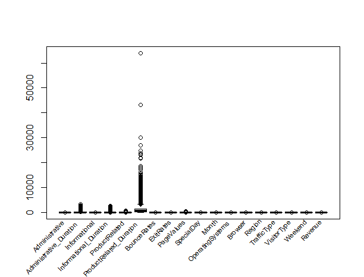

# **Kira Plastinina Customer Analysis (Week 13 IP)**

## **Defining the Research Problem**

### **Defining the Question**

Kira Plastinina is a Russian brand that is sold through a defunct chain of retail stores in Russia, Ukraine, Kazakhstan, Belarus, China, Philippines, and Armenia. The brand's Sales and Marketing team would like to understand their customer's behavior from data that they have collected over the past year. More specifically, they would like to learn the characteristics of customer groups.

**Goals** - Perform clustering stating insights drawn from your analysis and visualizations.
          - Provide comparisons between k-means and hierarchical clustering methods performed on the data.

### **Defining the metric for success**

This undertaking is going to be considered successful in the event that I am able to visualize clusters by plotting the dendograms.

### **Understanding the context**

Kira Platinina is an online platform that sells commodities online. Customers visit the site frequently and go through the pages in the website. The organization wishes to understand the groups of customers that they have(clusters), and the behaviors of the groups when it comes to going through the commodities. This will help them in developing an efficient approach in their marketing strategy.
My work is to identify the various groups within the customers and classify them into clusters and thereafter find their behaviors within the website. I am to use k-means and hierarchical clustering methods for that and compare the results from the same. I should also use the DBSCAN algorith for challeging the two and seeing if the perfomance will be better.

### **Recording the experimental design**

Below are the stages that I am going to follow:

1. Problem Definition
2. Data Sourcing
3. Check the Data
4. Perform Data Cleaning
5. Perform Exploratory Data Analysis  (Univariate, Bivariate & Multivariate)
6. Implement the Solution
7. Challenge the Solution
8. Follow up Questions

### **Relevance of Data**

The data provided is relevant

## **Data Reading and Checking**

### **Importing Libraries**

```R
#importing needed libraries for use
library("data.table")
library(tidyverse)
library(dplyr)
```
## **Loading and Checking The Data**
### **Loading the dataset**

```R
#loading our dataset
dataset <- fread("http://bit.ly/EcommerceCustomersDataset")
```

## **Checking and Tidying the Data**

### **Checking the Data**

```R
#checking the top of the dataset
head(dataset)
```
```R
#checking for the attributes of the columns
str(dataset)
```
### **Tidying the Data**
**Missing Values**
```R
#checking for missing values
colSums(is.na(dataset))
```
There are several missing values in the columns which we are going to remove.

- Administrative - 14
- Administrative_Duration - 14
- Informational - 14
- Informational_Duration - 14
- ProductRelated - 14
- ProductRelated_Duration - 14
- BounceRates - 14
- ExitRates - 14

```R
#removing the missing values.
dataset_1 <- na.omit(dataset)
```
**Duplicates**
```R
#checking for duplicates.
anyDuplicated(dataset_1)
```
Our dataset has 159 duplicates. We are going to remove these in the tidying stage.
```R
#dropping the duplicates
dataset_2 <- dataset_1 %>% distinct()
```
**Encoding some categorical columns**
```R
#converting the weekend, revenue and month columns to factors for encoding
dataset_2$Weekend[] <- as.factor(dataset_2$Weekend)
dataset_2$Revenue[] <- as.factor(dataset_2$Revenue)
dataset_2$Month[] <- as.factor(dataset_2$Month)
dataset_2$VisitorType[] <- as.factor(dataset_2$VisitorType)

#replacing the column values with the matrical values.
dataset_2$Weekend[] <- data.matrix(dataset_2$Weekend)
dataset_2$Revenue[] <- data.matrix(dataset_2$Revenue)
dataset_2$Month[] <- data.matrix(dataset_2$Month)
dataset_2$VisitorType[] <- data.matrix(dataset_2$VisitorType)
```
**_Weekend_**

- FALSE - 1
- TRUE - 2

**_Revenue_**

- FALSE - 1
- TRUE - 2

**_Month_**

- Aug - 1
- Dec - 2
- Feb - 3
- July - 4
- June - 5
- Mar - 6
- May - 7
- Nov - 8
- Oct - 9
- Sep - 10

**_Visitor Type_**

- New_Visitor - 1
- Other - 2
- Returning_Visitor - 3
```R
#changing the data types to numeric for easier analysis.
dataset_2$Administrative <- as.numeric(dataset_2$Administrative)
dataset_2$Informational <- as.numeric(dataset_2$Informational)
dataset_2$ProductRelated <- as.numeric(dataset_2$ProductRelated)
dataset_2$Month <- as.numeric(dataset_2$Month)
dataset_2$OperatingSystems <- as.numeric(dataset_2$OperatingSystems)
dataset_2$Browser <- as.numeric(dataset_2$Browser)
dataset_2$Region <- as.numeric(dataset_2$Region)
dataset_2$TrafficType <- as.numeric(dataset_2$TrafficType)
dataset_2$VisitorType <- as.numeric(dataset_2$VisitorType)
dataset_2$Weekend <- as.numeric(dataset_2$Weekend)
dataset_2$Revenue <- as.numeric(dataset_2$Revenue)
#viewing the top of the dataset
head(dataset_2)
```

#
**Outliers**
```R
#A boxplot of the outliers in the dataset
boxplot(dataset_2, xaxt = "n")
text(x = 1:length(dataset_2),
     ## Move labels to just below bottom of chart.
     y = par("usr")[3.3] - 0.7,
     ## Use names from the data list.
     labels = names(dataset_2),
     ## Change the clipping region.
     xpd = NA,
     ## Rotate the labels by 35 degrees.
     srt = 45,
     ## Adjust the labels to almost 100% right-justified.
     adj = 1.1,
     ## Increase label size.
     cex = 0.7)
```


- The Product related duration column has little outliers and we are not going to remove these as one may have spent a huge amount of time on the particular page.
```R
#creating our final dataset for analysis and modelling.
dataset_final <- dataset_2

```
```R
head(dataset_final)
```
# **Exploratory Data Analysis**
## **Univariate Analysis**
- We will start of with checking for the measures of central tendency and dispersion in the columns
```R
#printing numerical summary for the dataset
summary(dataset_final)
```
- From our summary, we can see that product related pages have a very high duration compared to other pages and display a huge range. Admnistrative pages follow in the list and Informational come in last.
```R
#creating a function for the mode calculation
getmode <- function(v) {
   uniqv <- unique(v)
   uniqv[which.max(tabulate(match(v, uniqv)))]
}

#finding modes for the columns

Administrative_mode <- getmode(dataset_final$Administrative)
Administrative_mode
#the mode for the Adminitrative column is 0.

Administrative_Duration_mode <- getmode(dataset_final$Administrative_Duration)
Administrative_Duration_mode
#the mode for the Administrative_Duration column is 0.

Informational_mode <- getmode(dataset_final$Informational)
Informational_mode
#the mode for the Informational column is 0.

Informational_Duration_mode <- getmode(dataset_final$Informational_Duration)
Informational_Duration_mode
#the mode for the Informational_Duration column is 0.

ProductRelated_mode <- getmode(dataset_final$ProductRelated)
ProductRelated_mode
#the mode for the ProductRelated column is 1.

ProductRelated_Duration_mode <- getmode(dataset_final$ProductRelated_Duration)
ProductRelated_Duration_mode
#the mode for the ProductRelated_Duration column is 0.

BounceRates_mode <- getmode(dataset_final$BounceRates)
BounceRates_mode
#the mode for the BounceRates column is 0.

ExitRates_mode <- getmode(dataset_final$ExitRates)
ExitRates_mode
#the mode for the ExitRates column is 0.2

PageValues_mode <- getmode(dataset_final$PageValues)
PageValues_mode
#the mode for the PageValues column is 0

Month_mode <- getmode(dataset_final$Month)
Month_mode
#the mode for the Month column is 7

OperatingSystems_mode <- getmode(dataset_final$OperatingSystems)
OperatingSystems_mode
#the mode for the OperatingSystems column is 2

Browser_mode <- getmode(dataset_final$Browser)
Browser_mode
#the mode for the Browser column is 2

Region_mode <- getmode(dataset_final$Region)
Region_mode
#the mode for the Region column is 1

TrafficType_mode <- getmode(dataset_final$TrafficType)
TrafficType_mode
#the mode for the TrafficType column is 2

VisitorType_mode <- getmode(dataset_final$VisitorType)
VisitorType_mode
#the mode for the VisitorType column is 3

Weekend_mode <- getmode(dataset_final$Weekend)
Weekend_mode
#the mode for the Weekend column is 1

Revenue_mode <- getmode(dataset_final$Revenue)
Revenue_mode
#the mode for the Revenue column is 1

```
- From the modes, we can see the following:
- The busiest month is the month of May.
- The website is mostly used during the weekdays.
- Most users are returning visitors.

### **Histograms for various columns**
```R
hist(dataset_final$ProductRelated, main = "Distribution of Product Related Pages", xlab = "Pages")
```


```R
hist(dataset_final$Administrative, main = "Distribution of Administrative Pages", xlab = "Pages")
```


```R
hist(dataset_final$Informational, main = "Distribution of Informational Pages", xlab = "Pages")
```


- All three plots are skewed to the right. This indicates that traffic happens mostly within the first pages of the three categories.
- This is a key finding as it shows the behaviour of all the customers.

```R
hist(dataset_final$Month, main = "Distribution of Traffic in the Months", xlab = "Months")
```


```R
hist(dataset_final$ProductRelated_Duration [dataset_final$VisitorType == 1], main = "Duration of New Visitors on Product Related Pages", xlab="Duration")
```

```R
hist(dataset_final$Informational_Duration [dataset_final$VisitorType == 1], main = "Duration of New Visitors on Informational Pages", xlab="Duration")
```

```R
hist(dataset_final$Administrative_Duration [dataset_final$VisitorType == 1], main = "Duration of New Visitors on Administrative Pages", xlab="Duration")
```


- From the above plots, we can see that all new visitors spend most of the time on the first pages of each category.
```R
hist(dataset_final$ProductRelated_Duration [dataset_final$VisitorType == 3], main = "Duration of Returning Visitors on Product Related Pages", xlab="Duration")
```

```R
hist(dataset_final$Informational_Duration [dataset_final$VisitorType == 3], main = "Duration of Returning Visitors on Informational Pages", xlab="Duration")
```

```R
hist(dataset_final$Administrative_Duration [dataset_final$VisitorType == 3], main = "Duration of Returning Visitors on Administrative Pages", xlab="Duration")
```


- From the above plots, we can see that all returning visitors spend most of the time on the first pages of each category.
```R
hist(dataset_final$ProductRelated_Duration [dataset_final$VisitorType == 2], main = "Duration of Others on Product Related Pages", xlab="Duration")
```

```R
hist(dataset_final$Informational_Duration [dataset_final$VisitorType == 2], main = "Duration of Others on Informational Pages", xlab="Duration")
```

```R
hist(dataset_final$Administrative_Duration [dataset_final$VisitorType == 2], main = "Duration of Others on Administrative Pages", xlab="Duration")
```


- From the above plots, we can see that all people in the others category spend most of the time on the first pages of each category.

- In general, all visitors to the website, regardless of their type, spend most time on the first few pages. Our graphs are all rightly skewed and this shows a hint of imbalancement in the data.

## **Bivariate & Multivariate Analysis**
```R
#creating a correlation matrix
res <- cor(dataset_final.final) 
round(res, 2)
```
```R
install.packages("corrplot")
require(corrplot)

#plotting the correlation matrix for viewing.
corrplot(res, method = "circle")
```


- According to the correlation matrix, we can see that there is a relationship between the following columns
  - Administrative and Administrative_Duration(0.60)
  - Informational and Informational_Duration(0.62)
  - ProductRelated and ProductRelated_Duration(0.86)
  - BounceRates and ExitRates(0.90)
  - PageValues and Revenue(0.49)
- We can understand the relation between the pages ad the relation with the duration spent on them. I will thus check on bouncerates and exitrates as well as page values and revenue.

```R
plot(dataset_final$BounceRates, dataset_final$ExitRates, xlab="Bounce Rates", ylab="Exit Rates")
```


```R
plot(dataset_final$PageValues, dataset_final$Revenues, xlab="Page Values", ylab="Revenues")
```


# **Implementing the Solution**
### **K-Means Clustering**
```R
#creating a function for normalizing our columns.
normalize <- function(x){
  return ((x-min(x)) / (max(x)-min(x)))
}
```
```R
dataset_final.1 <- dataset_final
```
```R
dataset_final.1$Administrative <- normalize(dataset_final.1$Administrative)
dataset_final.1$Administrative_Duration <- normalize(dataset_final.1$Administrative_Duration)
dataset_final.1$Informational <- normalize(dataset_final.1$Informational)
dataset_final.1$Informational_Duration <- normalize(dataset_final.1$Informational_Duration)
dataset_final.1$ProductRelated <- normalize(dataset_final.1$ProductRelated)
dataset_final.1$ProductRelated_Duration <- normalize(dataset_final.1$ProductRelated_Duration)
dataset_final.1$BounceRates <- normalize(dataset_final.1$BounceRates)
dataset_final.1$ExitRates <- normalize(dataset_final.1$ExitRates)
dataset_final.1$PageValues <- normalize(dataset_final.1$PageValues)
dataset_final.1$SpecialDay <- normalize(dataset_final.1$SpecialDay)
dataset_final.1$Month <- normalize(dataset_final.1$Month)
dataset_final.1$OperatingSystems <- normalize(dataset_final.1$OperatingSystem)
dataset_final.1$Browser <- normalize(dataset_final.1$Browser)
dataset_final.1$Region <- normalize(dataset_final.1$Region)
dataset_final.1$TrafficType <- normalize(dataset_final.1$TrafficType)
dataset_final.1$VisitorType <- normalize(dataset_final.1$VisitorType)
dataset_final.1$Weekend <- normalize(dataset_final.1$Weekend)
dataset_final.1$Revenue <- normalize(dataset_final.1$Revenue)
```
```R
install.packages("factoextra")
library(factoextra)
```
```R
kmean_withinss <- function(k) {
    cluster <- kmeans(dataset_final.1, k)
    return (cluster$tot.withinss)
}
```
```R
wss <- sapply(2:20, kmean_withinss)
elbow_method <-data.frame(2:20, wss)
```
```R
ggplot(elbow_method, aes(x = X2.20, y = wss)) +
    geom_point() +
    geom_line() +
    scale_x_continuous(breaks = seq(1, 20, by = 1))
    
```


- We can see from the graph that the optimal value for k is 8 as that is where we are having a start for diminishing returns.
- We are not going to use however, since we are using revenue to see the benefit of the customer groups. We will thus use 2 as our k since eveue has 2 classes.

```R
dataset.new<- dataset_final.1[, c(1:17)]
dataset.class<- dataset_final.1[, "Revenue"]
```
```R
result <- kmeans(dataset.new,2)
```
```R
View(result$size)
```

```R
View(result$centers)
```
```R
View(result$cluster)
```
- We have classified the customers into two clusters with the following numbers:
    - 1 = 937
    - 2 = 11262
```R
fviz_cluster(result, data = dataset.new[, 1:10], geom = "point", ellipse.type = "convex")
```


### **Hiearchical Clustering**
```R
scale_dataset <- scale(dataset_final.1)

```
```R
d <- dist(scale_dataset, method = "euclidean")
```
```R
res.hc <- hclust(d, method = "ward.D2" )
```
```R
plot(res.hc, cex = 0.6, hang = -1)
```


-The dendogram is very squeezed and cannot be used. Hierarchical clustering can't be useful in our grouping in this case.

## **Challenging the Solution**

### **DBSCAN Clustering**

```R
install.packages("dbscan")
library("dbscan")
```
```R
dbscan::kNNdistplot(dataset.new, k =  2)
abline(h = 0.35, lty = 2)
```
- Our line has fitted most well at the 0.35 mark and thus this is going to be our eps value.
```R
db <- dbscan(dataset.new,eps=0.35,MinPts = 2)
print(db)
```
```R
hullplot(dataset.new,db$cluster)
```


# **Conclusion and Recommendation**


